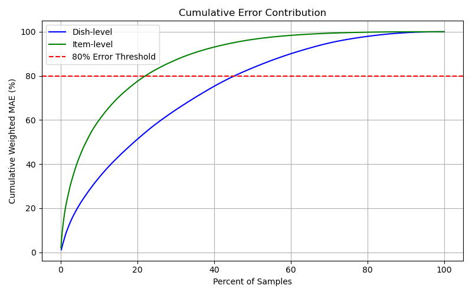
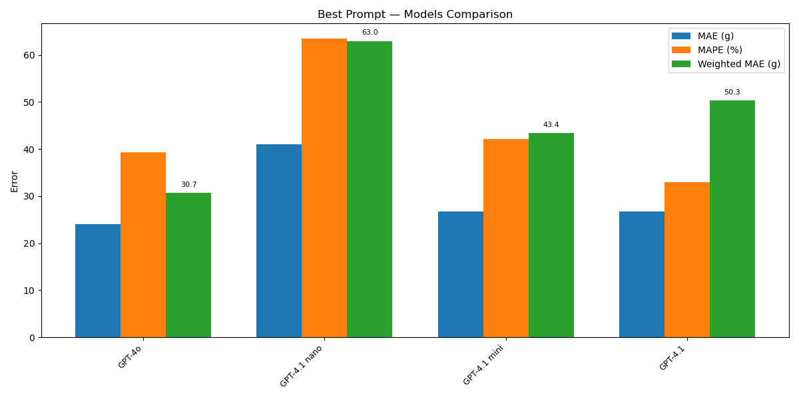

# Volumetric Estimation of Food — Bachelor Project

## Overview

This Bachelor project was carried out at the Digital Epidemiology Lab (EPFL), under the supervision of Prof. Marcel Salathé.

The goal of the project was to evaluate and optimize a large language model (LLM)-based pipeline for estimating the weight of food items from images, with applications in personalized nutrition tracking. This work directly supports the development of the [MyFoodRepo](https://www.myfoodrepo.org) platform, an open-source food tracking tool used in digital health research.

The benchmarking tool used in this project was developed by the lab specifically for evaluating prompt-based pipelines and LLM outputs on structured datasets.

An initial prototype (Version 1) was developed as a baseline to understand the challenges. The final version (Version 2) implements a more robust and scalable approach.

## Table of Contents
- [Overview](#overview)
- [Pipeline Summary](#pipeline-summary)
- [Version 1](#version-1-v1-2025-04-03)
- [Version 2](#version-2)
- [Data Cleaning Procedure](#data-cleaning-procedure-formatpy)
- [Running LLM Predictions](#running-llm-predictions)
- [Running Comparisons](#running-comparisons-comparisonspy)
- [Automatic Prompt Optimization](#automatic-prompt-optimization-using-openai-api-prompt_optipy)
- [Prompt Engineering Strategy](#prompt-engineering-strategy)
- [Results](#results)

## Pipeline Summary

1. **Data preparation**  
   Format raw food data into a structure accepted by the benchmarking tool.  
   Clean the dataset to remove incorrect annotations to ensure data quality.

2. **LLM prediction**  
   Generate predictions using the benchmarking tool with a custom prompt.

3. **Result analysis**  
   Evaluate predictions by comparing them to ground truth weights and computing errors.

4. **Prompt optimization (optional)**  
   Analyze error-prone predictions and automatically optimize the prompt with GPT-o3.

5. **Re-evaluation**  
   Test the new prompt on the same data and compare performance.

---

## Version 1 (v1-2025-04-03)

**Description:** First attempt to test the feasibility of using an LLM for food weight estimation with minimal data preparation. This version was not used in the final evaluation but is retained for transparency and traceability. Each prompt asked the LLM to estimate the weight of a **single food class per image**. No cleaning or grouping of data was applied.

### Folder structure

#### `data/v1/`

| File / Folder | Description |
|---------------|-------------|
| `weight_data.csv` | Original raw data |
| `weight_data_ready.csv` | Formatted version for benchmarking |
| `weight_data_sample.csv` | Random 100-sample subset |
| `weight_data_sample_ready.csv` | Formatted sample data |
| `result/{result_file_id}` | LLM output predictions |
| `comparison_data/comparison_{result_file_name}` | Raw comparison between predictions and ground truth |
| `comparison_data/sorted_{result_file_name}` | Same as above, but sorted by absolute error |
| `prompt_data/prompt_{result_file_id}` | Prompt used for the prediction file |

#### `src/v1/`

| File | Description |
|------|-------------|
| `format.py` | Formats data for benchmarking |
| `comparison.py` | Computes and saves prediction errors |
| `metrics_results.csv` | Metrics summary for each result file |

---

## Version 2

**Description:** A refined version where the model is given all the food item present on the image but is asked to estimate only one target item. Includes a cleaned and more structured dataset.

### Folder structure

#### `data/`

| File / Folder | Description |
|---------------|-------------|
| `cleaned/weight_data_cleaned.csv` | Cleaned dataset |
| `cleaned/weight_data_cleaned_no_liquid.csv` | Same as above without liquids |
| `cleaned/weight_data_cleaned_grouped.csv` | Cleaned data + list of all food items per image |
| `cleaned/weight_data_cleaned_grouped_no_liquid.csv` | Same as above without liquids |
| `cleaned/weight_data_cleaned_sample_{timestamp}.csv` | Sample subset from grouped cleaned data |
| `comparison/sorted_result_{result_file_id}` | Sorted error output |
| `prompt/optimized/optimized_prompt_{prompt_nb}_{timestamp}` | Result of automatic prompt optimization |
| `prompt/prompt_{prompt_nb}_{result_file_id}` | Prompt used to generate the corresponding prediction |
| `ready` | Contains all the files from the cleaned folder formatted for benchmarking |
| `removed_logs.csv` | Log of removed rows and their removal reasons |
| `result/result_{result_file_id}` | LLM output predictions |
| `weight_data.csv` | Original raw data |


---

#### `src/`

| File | Description |
|------|-------------|
| `comparison.py` | Compares prediction vs. ground truth and generates error metrics |
| `format.py` | Prepares data (raw → ready format), supports filtering out liquids |
| `metrics_results.csv` | Metrics summary for all result files. Do not delete any rows from this file, adding new rows is permitted. |
| `outputs` | Contains the images and CSV generated by ```visualize_results.ipynb``` |
| `prompt_opti.py` | Prompt optimizer using OpenAI API |
| `visualize_results.ipynb` | Jupyter Notebook to visualize prompt performance and error distribution |

---

## Data cleaning procedure (format.py)
1. When deleting a row in `weight_data_cleaned.csv`, **add it to `removed_logs.csv`** with a reason for deletion. To delete liquids automatically (by name) add it to the liquid list in the method ```remove_liquids``` in ```format.py```.
2. Update the ready files using:   
   ```python format.py --liquid```  
3. Generate a version without liquids:   
   ```python format.py --no-liquid```  
4. Generate a new sample without liquids:  
   ```python format.py --no-liquid --sample```    
5. Change the ```csv_file``` variable in the file ```comparison.py``` with the name of the new sample file  

**Optional argument:**
- ```--size```: to specify the size of the sample, default = 100.

**Remark:** When running `format.py`, the cleaned (full) dataset is overwritten, hence previous versions are lost. If you want to keep a history of changes, you can modify the script to generate new files with timestamps (as is already done for sample files).  
This behavior (keeping only one version) is the current design of the project. Timestamped versioning for the full dataset has not been implemented.  
`weight_data.csv` contains the original raw data and should not be modified.

---

## Running LLM predictions

Evaluation was performed using a private benchmarking platform developed by the lab. Access requires user authentication and is currently limited to internal users and collaborators.

Predictions are generated using the benchmarking tool, which requires:
- A `.csv` dataset file (produced by `format.py` and stored in the `ready` folder, see [here](./data/ready/weight_data_cleaned_sample_ready_20250604.csv) for an example)
- A prompt (to be copy-pasted manually)

To run predictions:
1. Upload the dataset to the benchmarking tool, where at least one column (e.g., `00_MSG_00_TEXT`) is used as the user prompt for LLM calls
2. Create a *New Experiment* 
3. Select the desired LLM
4. Paste the prompt
5. Create a *New Result* under that experiment
6. Download the result and add it to the `result` folder

Mutliple results can be created at the same time. The tool processes responses in the background and provides downloadable JSON files containing model outputs.

---

## Running comparisons (comparisons.py)

Once a result file has been generated by the LLM, it can be evaluated with the following steps:  

If the data is a **sample**:  
```python comparison.py --json {result_file_name}```  
This will generate a `sorted_{result_file_name}` file with predictions sorted by absolute error.

If the data is the **full dataset**:  
```python comparison.py --json {result_file_name} --wholedata```  
This will sort based on total dish weight absolute error.   

**Optional arguments**:
- ```--liquid```: to specify that the dataset contains liquids.
- ```--errors```: display the top 20 highest errors examples in the terminal.
- ```--best```: display the 20 lowest errors examples in the terminal.

**Remark**:
Make sure that the variable ```csv_file``` in the function ```load_data``` is the name of the file containing the ground truth values
that should be compared with the results i.e. for a comparison with the full dataset `../data/cleaned/weight_data_cleaned_no_liquid.csv` and with a sample dataset `../data/cleaned/weight_data_cleaned_sample_{timestamp}.csv`.  


---

## Automatic Prompt optimization using OpenAI API (prompt_opti.py)

Optimize a prompt using:  
```python prompt_opti.py --prompt {prompt_file} --errors {result_file}```  

**Arguments**:
- ```--prompt```: name of the file containing the prompt to optimize (e.g. prompt_3_...)  
- ```--errors```: CSV file containing the sorted results generated by that model prediction    

**Output**:  
Optimized prompt: `data/prompt/optimized/optimized_prompt_{prompt_nb}_{timestamp}.md`, contains the base prompt and all the details about the modifications    
New base prompt: `data/prompt/prompt_{n}_.md`, where n is the original prompt number incremented by 1  

**Remark**:
Don't forget to put the OpenAI API key in a `.env` file as a value for the variable `OPENAI_API_KEY` and add `.env` in the `.gitignore`.

---

## Prompt Engineering Strategy

I began my project by designing a prompt compatible with GPT-4o, the model used by MyFoodRepo at the time. I iteratively refined this prompt through more than 60 versions, experimenting with changes in structure, tone, and content.

Initially, I adopted a structured format composed of: *Given, Task, Instructions, Output Format,* and *Examples*. I later introduced a section emphasizing the *role* of the language model, which noticeably improved output quality. I also experimented with zero-shot prompting, where GPT-4o performed particularly well. A key improvement came from prompting the model to begin its reasoning with the sentence: “Let’s work this out in a step-by-step way to be sure we have the right answer,” a strategy inspired by the work of [Zhou et al. (2023)](https://doi.org/10.48550/arXiv.2211.01910) on automatic prompt generation with large language models.

During testing, I observed that liquids were often poorly estimated, which significantly increased overall error. To address this, I removed liquids from the task, a decision validated by Prof. Salathé, as the project’s primary focus was on solid foods.

As the prompt evolved, it became increasingly complex, with many detailed subsections. However, upon switching to GPT-4.1 mini (2025-04-14) after its release, performance initially dropped considerably. By restructuring the prompt according to [OpenAI’s guidelines](https://cookbook.openai.com/examples/gpt4-1_prompting_guide) for GPT-4.1 prompting, I was able to improve accuracy. Unlike GPT-4o, GPT-4.1 mini was more effective with few-shot examples rather than zero-shot prompting.

**The final prompt structure includes the following sections:**
- Role and objective
- Input format
- Critical rules to follow exactly: Key instructions (e.g., exclude container weight, base estimations solely on visible evidence)
- Estimation methodology: Step-by-step reasoning strategy tailored for food estimation
- Special cases: Instructions for handling mixed dishes, processed foods, and multiple items
- Output format
- Quality checklist: A series of questions to verify output quality before submission
- Examples
- Context: Recap of the task’s goals and high-priority guidelines
- Final instructions: Key reminders in bullet-point form

[Here](./data/prompt/final_prompt.md) is the final prompt.


**Most impactful prompt strategies:**  
- **Emphasizing visual cues for portion estimation:**  
   Prompt variants that instructed the model to “pay attention to large portions” and assess whether items were full or partially served significantly reduced errors, especially for complex or cropped dishes.  

- **Handling special cases explicitly:**  
   Including guidelines for cut items, partially visible portions, or dishes with mixed densities improved robustness.

- **Considering food volume and container context:**  
   Prompts that asked the model to factor in visual container size and food density helped with high-volume, low-mass items.

- **Specifying the pictures were taken in Switzerland:**  
   Adding geographic context did not immediately improve estimation accuracy, but the LLM began referencing it in its reasoning to tailor predictions. I chose to keep it, as it likely helps align the model’s assumptions with culturally relevant portion sizes and reduces bias toward American-style servings, especially when used with a well-structured prompt.

**Automatic Prompt Optimization**  
This feature was briefly explored when I was looking for new prompt ideas. Initially, GPT-o3 modified the original prompt too much. After instructing it to make only minimal changes, the output behaved as expected; however, this did not improve model performance. Even when incorporated into the pipeline and applied iteratively to predictions generated by the last suggested prompt, no performance gains were observed. As a result, I did not fully adopt this approach, I used it only occasionally to generate inspiration. Overall, this was an experimental test to evaluate whether automatic prompt optimization could boost results.


# Results

## Overall performance

The goal of this project was to identify a prompt for GPT-4.1 mini that minimized the weighted mean absolute error (Weighted MAE). I also tracked the mean absolute error (MAE) and mean absolute percentage error (MAPE) to gain insights into whether the model struggled more with heavy or light food items.

The [best-performing prompt](./data/prompt/final_prompt.md) achieved the following results:  
- **Weighted MAE:** 37.93g  
- **MAE:** 32.08g  
- **MAPE:** 62.33%  

A complete visualization is available [here](./src/outputs/best_prompt.png).

Considering that the first prompts with GPT-4.1 mini produced a Weighted MAE of about 70g, this represents an improvement of nearly 50%, which reflects a significant performance improvement. The notably higher MAPE compared to the MAE indicates that the model performs worse on lighter food items. This suggests a potential direction for future prompt refinement.

See [metrics.md](./metrics.md) for full definitions and formulae of MAE, MAPE, and Weighted MAE.  
Full table of results is available in `metrics_results.csv`. Do not delete any rows from this file, adding new rows is permitted.


## Model comparison
At the beginning of the project, I used GPT-4o, as GPT-4.1 mini was not yet available. After testing a prompt that performed well on GPT-4o, I noticed a significant performance drop when using the same prompt with GPT-4.1 mini and Gemini 2.0. As mentioned by OpenAI, GPT-4.1 mini is much more sensitive to prompt structure, contradictions, and implicit assumptions. Therefore, a prompt that works well for GPT-4o does not necessarily generalize to 4.1 mini (see [this](./src/outputs/same_prompt_models_comparison_1.png) graph).

Following OpenAI’s recommendations, I restructured the prompt to include only the most essential information. I began with a minimal version and incrementally added specifications, aiming to keep it as unbiased and neutral as possible. I chose not to include standard portion sizes for each food type, as the model tended to rely too heavily on them, even when I emphasized using them only as guidelines.

We were also interested in understanding the distribution of errors. For the best-performing prompt ran on the whole dataset, we observed that 45% of dishes account for 80% of the total Weighted MAE, while only 22% of individual food items account for the same amount. This suggests that some dishes, possibly those with many components or unusual compositions, introduce disproportionate error. At the food item level, errors were often associated with mixed dishes mentioned as a single item (e.g., pizza or vegetable stews like *ratatouille*), as well as multiple identical items grouped together (e.g., a bowl of cherry tomatoes), which are more challenging to estimate accurately.

<p align="center">
  <br>
  <em>Figure 1: Cumulative distribution of error across dishes and food items.</em>
</p>

Out of curiosity, I ran a final comparison using the best-performing GPT-4.1 mini prompt on all the other models. Here are the results on a sample dataset:

<p align="center">
  <br>
  <em>Figure 2: Performance comparison of GPT-4o, GPT-4.1 mini, nano, and full GPT-4.1 using the best prompt on a sample dataset.</em>
</p>

I had already ran a similar comparison when I started crafting a prompt for GPT-4.1 mini and the full GPT-4.1 model performed significantly better, with a Weighted MAE more than 20 g lower than that of GPT-4.1 nano (see [this](./src/outputs/same_prompt_models_comparison_3.png) graph). Interestingly, the full GPT-4.1 model, which previously outperformed the mini and nano versions, did not maintain that advantage here. While it still outperformed the nano version, it was slightly behind the mini version with this specific prompt. This highlights how sensitive these models are to prompt structure and how performance can shift depending on dataset composition and prompt optimization. Moreover, these models are not deterministic: same prompt and same data can lead to different outputs.